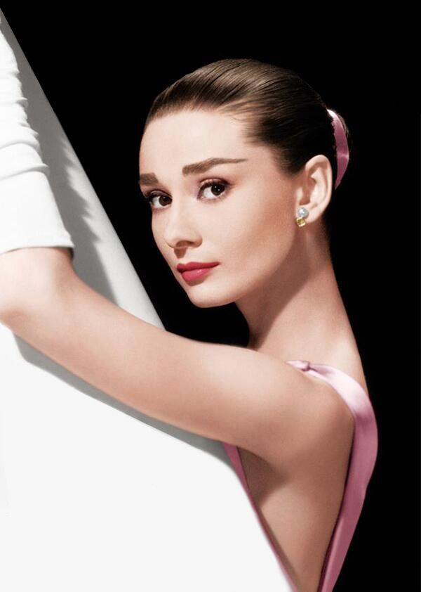

<!DOCTYPE html>
<html lang="en">
<head>
	<meta charset="UTF-8">
	<meta name="viewport" content="width=device-width,initial-scale=1">
	<title>Tribute page</title>
	<link rel="stylesheet" href="style.css">
	<link href="https://fonts.googleapis.com/css2?family=Lora&family=Raleway:wght@200&display=swap" rel="stylesheet"></head>
<body id="main">
<h1 id="title" text="Audrey Hepburn">Audrey Hepburn</h1>
<h3>The iconic woman</h3>

	
	<figure id="img-caption">Audrey Hepburn is seriously one of the most beautiful woman</figure>

<section id="tribute-info">
	<h3 id="headline"> This is a timeline of Audrey Hepburn`s life</h3>
<ul>
	<li><strong>May 4, 1929</strong> -
		Audrey Hepburn was born.</li>
	<li><strong>Jan 24, 1935</strong> -
		Hepburn's Parents Divorce</li>
	<li><strong>May 10, 1940</strong> -
		Pseudonym Edda van Heemstra.
		Audrey's mother sent her and her two half-brothers to live with their
		grandfather in the Netherlands because she felt it would be safe from German attack. In 1940, when the Germans invaded the Netherlands, Hepburn adopted the name Edda van Heemstra. Her given name was considered to be dangerous because it sounded English and indicated her British roots.</li>
	<li><strong>Apr 24, 1944 </strong>  - Audrey was an accompished ballerina and she secretly performed for groups of
		people. Over the winter of 1944, the Germans blocked supply routes for food and fuel leaving people to starve and freeze to death. Hepburn made flour out of tulip bulbs to bake cakes and biscuits. Hepburn suffered from malnutrition, anaemia, and respiratory problems. She passed time by drawing. The attached picture shows two of her drawings.</li>
	<li><strong>Apr 24, 1945</strong>  - After the war, Audrey moved to Amsterdam and took ballet lessons with Sonia
		Gaskell. She then studied at the Ballet Rambert and supported herself by working part time as a model. Rambert later told Hepburn that her poor nutrition during the war and the fact that she was relatively tall (5 ft 7) would keep her from becoming the prima ballerina she dreamed of. Hepburn decided to pursue acting.</li>
	<li><strong>Mar 24, 1948</strong>  - Release in 1948, "Dutch in Seven Lessons" was Hepburn's first appearance in the
		industry.</li>
	<li><strong>Feb 22, 1951</strong>  - In 1951, Audrey played a hotel receptionist in her first motion picture film,
		One Wild Oat. She also played minor roles in:
	<ul id="second-list">
		<li>Young Wives' Tale</li>
	<li>Laughter in Paradise</li>
	<li>The Lavender Hill Mob</li>
	<li>Monte Carlo Baby</li> </ul></li>
	<li><strong>Nov 24, 1951</strong> - During the making of Monte Carlo Baby, Audrey was chosen to play the lead role
		in the Broadway rendition of Gigi. It opened at the Fulton Theatre and ran for 219 performances. In the last months of its running, it was performed in San Francisco and Los Angeles. However, her first significant fil performance was in the Dickinson film "Secret People" which was release in 1952. She played a ballerina and did all her own dancing.</li>
	<li><strong>Mar 18, 1952</strong> -
		 Hepburn's First Engagement</li>
	<li><strong>Mar 30, 1954</strong> -
		 Audrey wins an Oscar Award</li>
	<li><strong>Sep 24, 1954</strong> -
		  Mel Ferrer and Audrey Hepburn married. They met at a party hosted by Gregory Peck. Rehearsals for the play
		"Odine" began in January and the following September they were married. She said they were inseparable and very happy but admitted he had a bad temper. Rumors said Ferrer was controlling; however, a friend of Hepburn said, "I think Audrey allows Mel to think he influences her."</li>
	<li><strong>Jul 17, 1960</strong> -
		 First Child Born</li>
	<li><strong>Mar 12, 1961</strong> -
		 Breakfast at Tiffany's</li>
	<li><strong>Dec 5, 1968</strong> -
		 Hepburn and Ferrer Divorce</li>
	<li><strong>Jan 18, 1969</strong> -
		 Second Marriage</li>
	<li><strong>Feb 8, 1970</strong> -
		 Second Child Born</li>
	<li><strong>May 30, 1982</strong> -
		 Hepburn and Dotti Divorce</li>
	<li><strong>Apr 25, 1988</strong> -
		 International Goodwill Ambassador</li>
	<li><strong>Nov 1, 1992</strong> -
		 Diagnosed with Cancer</li>
	<li><strong>Dec 11, 1992</strong> -
		 Presidential Medal of Freedom</li>
	<li><strong>Jan 20, 1993</strong> -
		 Audrey Hepburn Passes Away.Her dear friend and fashion designer, Hubert de Givenchy, arranged for Hepburn to
		be brought to her home in Switzerland from California. He sent her a private jet that he had filled with flowers. She died in her home on January 20, 1993. After hearing of her death, Gregory Peck tearfully read Hepburn's favorite poem, "Unending Love" by Rabindranath Tagore, on camera. </li>
	<li><strong>Jan 24, 1993</strong> -
		 Audrey Hepburn's Funeral. Hepburn's funeral services were held in Switzerland, on Sunday, January 24, 1993.
		UNICEF's Prince Sadruddin Aga Khan delivered a eulogy. Her family and friends were there, including her two sons, Sean and Luca, and her partner Robert Wolders. Her two sons and partner helped carry her coffin to the grave site. "Audrey Hepburn became more than a movie star. She became a legend, first on screen - and then on the arid plains of Africa." - Ian Woodward, Author</li>
</ul>
<h3>If you are interested, you should read more about this incredible human being on her <a id="tribute-link"
																							href="https://en.wikipedia.org/wiki/Audrey_Hepburn" target="_blank">Wikipedia
	entry</a>.
</h3>
</section>

</body>
</html>
